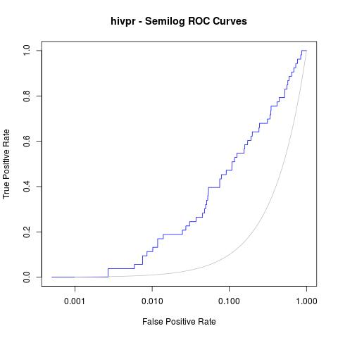

.. _calculating-roc-curves:

Calculating ROC curves
======================

(Original entry published in `CBDD Research Group Blog <http://www.ub.edu/cbdd/?q=content/how-calculate-roc-curves>`__.)

Here you will find a a short tutorial about how to generate Receiver operating characteristic (ROC) curves and other statistics after running rDock molecular docking (for other programs such as Vina or Glide, just a little modification on the way ``dataforR_uq.txt`` file is interpreted will make it work, see below).

I assume all of you are familiar with what ROC curves are, what are they for and how they are made.

Just in case, a very brief summary would be:

* `ROC curves <http://en.wikipedia.org/wiki/Receiver_operating_characteristic>`__ are graphic representations of the relation existing between the sensibility and the specificity of a test. It is generated by plotting the fraction of true positives out of the total actual positives versus the fraction of false positives out of the total actual negatives.
* In our case, we will use it for checking whether a docking program is able to select active ligands with respect to inactive ligands (decoys) and whether it is able to select these active ligands in the top % of a ranked database.
* R Library `ROCR <http://rocr.bioinf.mpi-sb.mpg.de/>`__ is mandatory (try with command ``install.packages("ROCR")`` in R before downloading from source).

The example selected for this tutorial is a system from the DUD benchmark set, "hivpr" or "hiv protease".

These are the files you will need (all can be downloaded in this `Dropbox shared folder <https://www.dropbox.com/sh/3cz5gnr8hz79kfa/AAAX0s0dG6ioPfAvUV7AJzqza?dl=0>`__):

* List of active ligands (``ligands.txt``)
* List of inactive ligands (``decoys.txt``)
* Output file with the docked poses of each ligand with the corresponding docking scores (``hivpr_all_results.sd.gz``)
* R script with all the R commands in this tutorial (``ROC_curves.R``)

Before getting into R, the resulted docked poses have to be filtered out for only having the best pose for each ligand (the smallest score – or highest in negative value). To do so run:

.. code-block:: bash

   gunzip hivpr_all_results.sd.gz
   sdsort -n -s -fSCORE hivpr_all_results.sd | sdfilter -f'$_COUNT == 1' >  hivpr_1poseperlig.sd
   #sdsort with -n and -s flags will sort internally each ligand by increasing score and sdfilter will get only the first entry of each ligand.

   sdreport -t hivpr_1poseperlig.sd | awk '{print $2,$3,$4,$5,$6,$7}' > dataforR_uq.txt
   #sdreport will print all the scores of the output in a tabular format and, with command awk, we will format the results

.. note::

   ``sdsort`` and ``sdreport`` are really useful tools for managing sd formatted compound collections. They are very user-friendly and free to download. They are provided along with rDock software in :ref:`rDock website <rdock-documentation>`. Go to :ref:`Download <download>` section for downloading rDock.

This ``dataforR_uq.txt`` (also in the Dropbox folder) file must contain one entry per ligand with the docked scores (what R will use to rank and plot the ROC curves).

R commands for generating ROC curves
------------------------------------

Then, run the following commands in R for plotting the ROC curves:

.. code-block:: r

   #load ROCR
   library(ROCR);

   #load ligands and decoys
   lig

Which will give us the following plot:

.. image:: _images/hivpr_Rinter_ROC.jpg

Afterwards, other useful statistics such as AUC or Enrichment factors can also be calculated:

.. code-block:: r

   #AUC (area under the curve)
   auc_rdock

.. code-block:: r

   AUC:
    0.7700965

.. code-block:: r

   #Enrichment Factors
   EF_rdock  0.01)[1]]
   EF_rdock_20  0.2)[1]]
   cat("Enrichment Factor top1%:\n")
   cat(EF_rdock_1)
   cat("\n\n")

.. code-block:: r

   Enrichment Factor top1%:
   11.11817

.. code-block:: r

   cat("Enrichment Factor top20%:\n")
   cat(EF_rdock_20)
   cat("\n\n")

.. code-block:: r

   Enrichment Factor top20%:
   3.200686

Moreover, a good analysis of these curves is to re-plot them in semilogarithmic scale (x axis in logarithmic scale). This way, one can focus on the early enrichment of the database and have a more detailed view of the selected actives in the top % of all the ligands.

.. code-block:: r

   jpeg("hivpr_semilog_ROC.jpg")
   rdockforsemilog=perfINTERuq@x.values[[1]]
   rdockforsemilog[rdockforsemilog < 0.0005]=0.0005
   plot(rdockforsemilog,perfINTERuq@y.values[[1]],type="l",xlab="False Positive Rate", ylab="True Positive Rate",xaxt="n", log="x", col="blue",main="hivpr - Semilog ROC Curves")
   axis(1, c(0,0.001,0.01,0.1,1))
   x<-seq(0,1,0.001)
   points(x,x,col="gray",type="l")
   dev.off()

Obtaining the following semi-logarithmic ROC curves:

